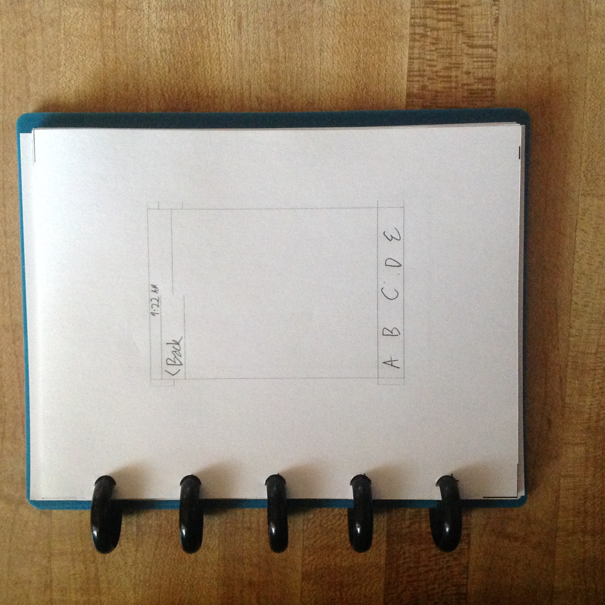

# Arc notebook mobile UI mockup templates
## Printable refill pages for small Staples Arc notebooks for mocking up mobile device UI

This is a set of PDFs that you can print out, cut into quarters, feed to an Arc hole punch, and then put into a “compact” (5×6 inch) Arc notebook, and use to mock up user interfaces for mobile (e.g., iPhone) applications.

**Make sure you print the PDF at *exactly* 100% scale.** Don't use “Scale to Fit Page” or anything similar. Otherwise, the measurements will be off.

### What's an Arc notebook?

It's a disc binder.

Unlike a ring binder, a disc binder uses solid discs with thick rims. Instead of a single cover, there are two separate cover panels. Both the cover panels and the sheets in between them have sort of T-shaped holes punched out of them, where the discs fit in.

The advantage over a ring binder is that you can remove, add, and reorder pages at will without having to open the rings, make sure pages you don't want to move stay put, etc.

The advantage over bound notebooks is that you can add and reorder pages at all.

Staples's brand of disc binder, discs, refills, etc., and specific dimensions of disc and hole, is “Arc”. If you imagine the cross-section of a rivet, with the semicircular head, that's what the holes in an Arc notebook look like—hence the name.

### What's an Arc hole punch?

Staples sells [a punch that you can use to make your own Arc refills](http://www.staples.com/M-by-Staples-Arc-System-Desktop-Punch-8-Sheet-Capacity/product_324688). With that, you're not limited to the four or so different kinds of refills that Staples sells; you can make any kind of refill you want.

Like these!

And yes, that punch is expensive. They're making up for their markup on refills. Feel free to make your own compatible punch if you've got the skills and tools for it.

### So what's this, then?

These are 4-up PDFs of refills for an Arc “compact” notebook. (The stated size of that model is 5.25 by 6 inches, but that includes the radius of the discs; the actual width is somewhere just under 5 inches.)

Each page has the outline of a mobile device's screen, with rules pre-printed for things such as iOS's status bar, navigation bar, and tab bar.

### Availability note

I couldn't find the “compact” model on Staples's website, so it may be discontinued. Try checking stores in person. If you have to ask after it, the model number is 22305 and the UPC number is 7-18103-17009-3. (“Junior” is *not* the same size—it is the next larger size, 5.5 by 8.5 inches.)

If the “compact” size does in fact turn out to have been discontinued, file an issue and I'll see about making a “junior” size version (probably with two screens per page). Of course, you're welcome to beat me to it and send a pull request instead.

### What's with the lines going only halfway across the screen?
An iOS app can choose to either have the status bar or not. On one side, I include the status bar and then the navigation bar below it. On the other side, the navigation bar only, with no status bar above it.

Each of the rules has a corresponding half-rectangle outside the opposite edge of the screen, so that you can use a ruler to complete the rule you care about.

### Open source

The PostScript (.ps) files are the source code. If you know PostScript, you can edit the generating machinery or make your own paper sizes.

If you do edit the source, use make to regenerate the PDFs. You'll need to have pstopdf installed; theoretically, either Ghostscript's or Apple's should work, though I've only tried Apple's. If you add any other paper sizes, you will need to add them to the Makefile.

The license is a typical BSD license. See [LICENSE.txt](LICENSE.txt) for details.
